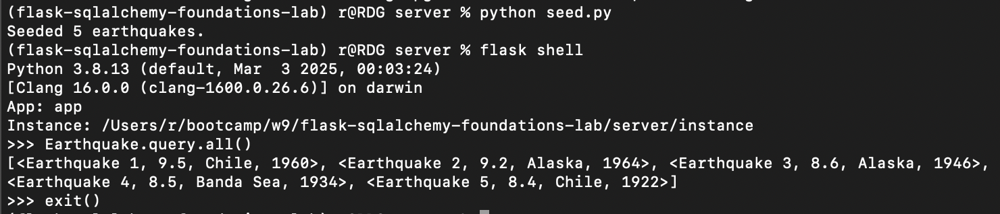

# Flask-SQLAlchemy Foundations: Earthquake Data

Backend service for storing and querying global earthquake events via JSON APIs.

## Table of Contents

- [Demo](#demo)
- [Setup](#setup)
- [Testing](#testing)
- [API Endpoints](#api-endpoints)

## Demo

## Setup

git clone the url of the repo
cd Lab-Flask-SqlAlchemy-Foundations/server
pipenv install
pipenv shell
export FLASK_APP=app.py
export FLASK_RUN_PORT=5555
flask db init && flask db migrate -m "initial" && flask db upgrade head
python seed.py
flask run

## Testing

pytest testing/models_test.py
pytest testing/app_earthquake_test.py
pytest testing/app_magnitude_test.py

## API Endpoints

GET /earthquakes/<int:id>
Returns one earthquake or 404 JSON error
GET /earthquakes/magnitude/<float:magnitude>
Returns { count, quakes: [ … ] }
